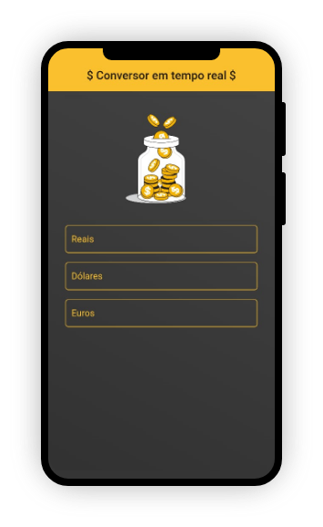
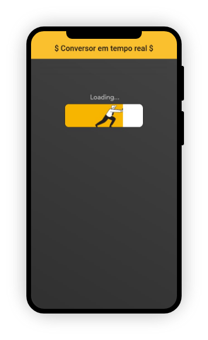
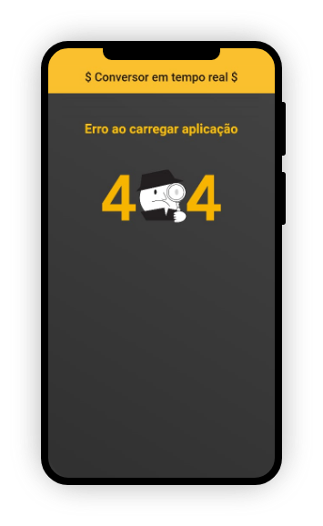

# Conversor de Moedas

<p align="center">
  <a href="#-projeto">Projeto</a>&nbsp;&nbsp;&nbsp;|&nbsp;&nbsp;&nbsp;
  <a href="#-design">Design</a>&nbsp;&nbsp;&nbsp;|&nbsp;&nbsp;&nbsp;
  <a href="#-tecnologias">Tecnologias</a>&nbsp;&nbsp;&nbsp;|&nbsp;&nbsp;&nbsp;
  <a href="#-instalação">Instalação</a>
</p>

## 📱 Projeto

Através desse aplicativo podemos calcular conversões de dinheiro entre as moedas **R$ Real**, **$ Dólar** e **€ Euro**.<br />
Os valores utilizados no cálculo são retirados da web de formq que estão sempre atualizados.

<p align="center">
  
</p>

## 🖌 Design

Venho estudando design para aplicar nas minhas aplicações Web e Mobile.<br />Um ponto muito importante que muitas pessoas se esquecem é sobre os **Estados de Design**.
Como deverá ser apresentado a tela ou componente se o mesmo estiver carregando? E se o que o usuário procurava não for encontrado? 
Devemos nos preocupar com a experiência do usuário durante todo o desenvolvimento do projeto.
<br /><br />
Abaixo estão as telas __Carregando__ e __404 Não encontrado__ do projeto.

<p align="center">
  
  
</p>

## 🚀 Tecnologias

Esse projeto foi desenvolvido com as seguintes tecnologias:

- [Flutter](https://flutter.dev/)
- [Dart](https://dart.dev/)

## 📁 Instalação

Para baixar esse projeto basta ter Git instalado no computador e executar o comando:
```
git clone https://github.com/rafacoelho4/ConversorMoeda.git
```

---

Feito com ♥ by Rafael Coelho Monte Alto
